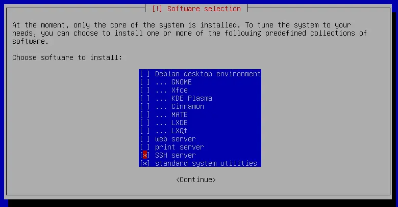
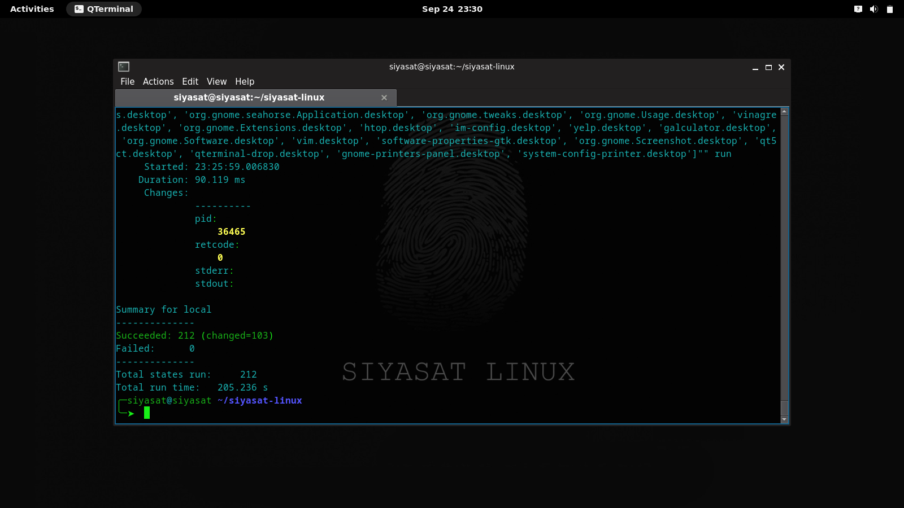
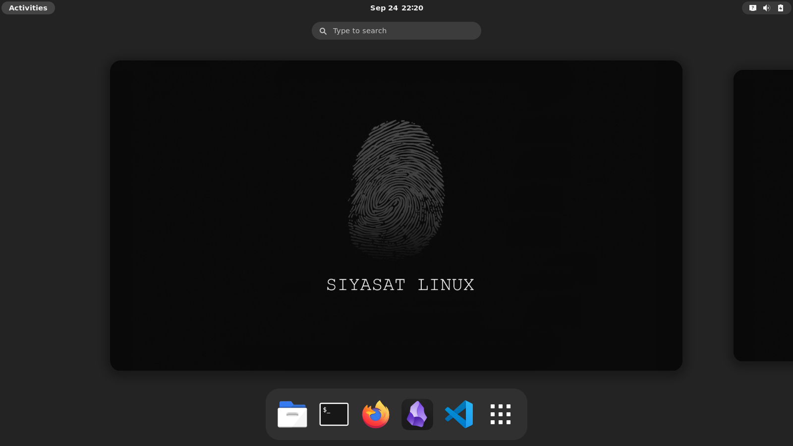
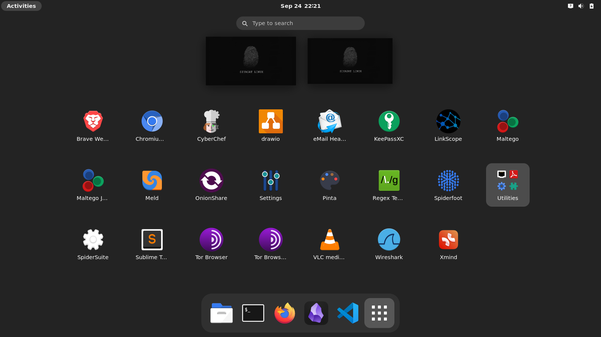

## Siyasat Linux

**Siyasat Linux** is a specialized distribution designed for Open Source Intelligence (OSINT) investigations, catering to the needs of threat intelligence analysts and other intelligence professionals. Built on the foundations of **Debian 12**, this provides a comprehensive suite of tools and customized environment to streamline your investigation workflows.

Download virtual machine image (OVA) here:
https://archive.org/details/reconvillageph-siyasat-linux

sha256sum: 06cfaf8f640c751dfab71918715fa8036ac7a9edc0712a721604faeda9ef4534

## Building the Distribution:

#### Base OS Preparation:
- Install a minimal Debian 12 from https://www.debian.org/CD/netinst/
- set username to '**siyasat**'
- Do not select a desktop environment during install. You might want to choose ssh server to continue installation remotely. 


#### Building
- clone this repo:
```
$ cd ~/
$ git clone https://github.com/reconvillageph/siyasat-linux/
```

- Start installation process as root:
```
$ su - 
# cd /home/siyasat/siyasat-linux
# ./install.sh
```

- This will take a while, so grab a cup of 'kapeng barako' ☕.
- After a while, you should be presented with the summary of the salt-stack build.



- if after the build, you have some errors (due to any reasons), just re-run the install script until you get '**Failed: 0**' results. You can also try to run:

```
# salt-call -l debug state.apply distro
```

## Screenshots:

Desktop:


Show Applications:


Tools List:

